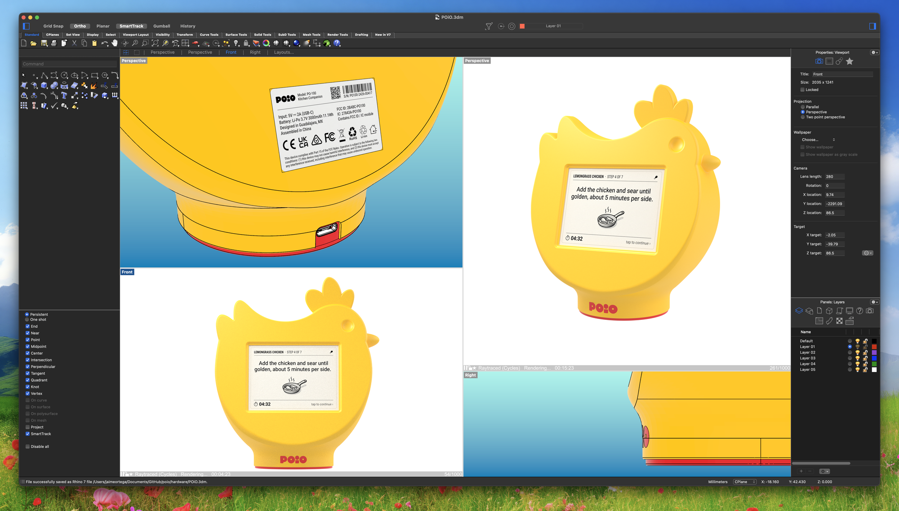

# Journal

## 2026-06-08

Decided to put down some raw ideas here, if anything just to keep track of my thoughts around this.

Saw Google announcing that Coral thing just the other day. Makes me think a future with local smart devices here and there around the house ain't that far off. Exciting and scary.

I mean, imagine a loud squawk from a thing on your kitchen counter mid-breakfast. Gotta keep the future a bit weird, though.

I've been going around the idea of squared vs. horizontal screen for this. Was leaning towards squared, but some quick mockups have me preferring horizontal now. Might be more practical. Gotta speed up the hardware prototype. Mocking up 3D renders for the case feels more like me getting artsy than solving the goddamn thing itself.

There are some UI prototypes we mocked up for this, haven't really had time to go over them. I'd like to put down some thoughts on paper for that as well. Going over recipes should feel better than going over a plain recipe book. This needs a bit of animation, a bit of soul; wonder if the refresh rate would be enough to get playful.

The 3D mockup has me sort-of satisfied. Not fully, but it's one of those things you gotta sleep on, I guess. See it for a while, check if the weird angles feel less or more weird over time. Still haven't modeled the buttons, but this screenshot suddenly has me preferring it button-less? Don't want to go that far for this first version, though.

